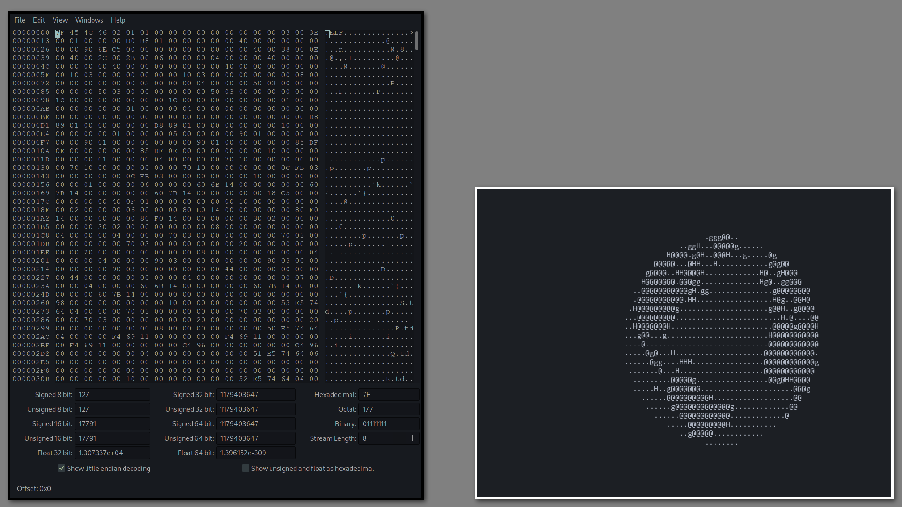

# NerdWM

NerdWM is a simple X11 window manager. This is just a small side project I am working on in my free time, with the intention of learning X11 and how window managers work.

Contributions are welcome but the primary goal of this project at the moment is learning.

